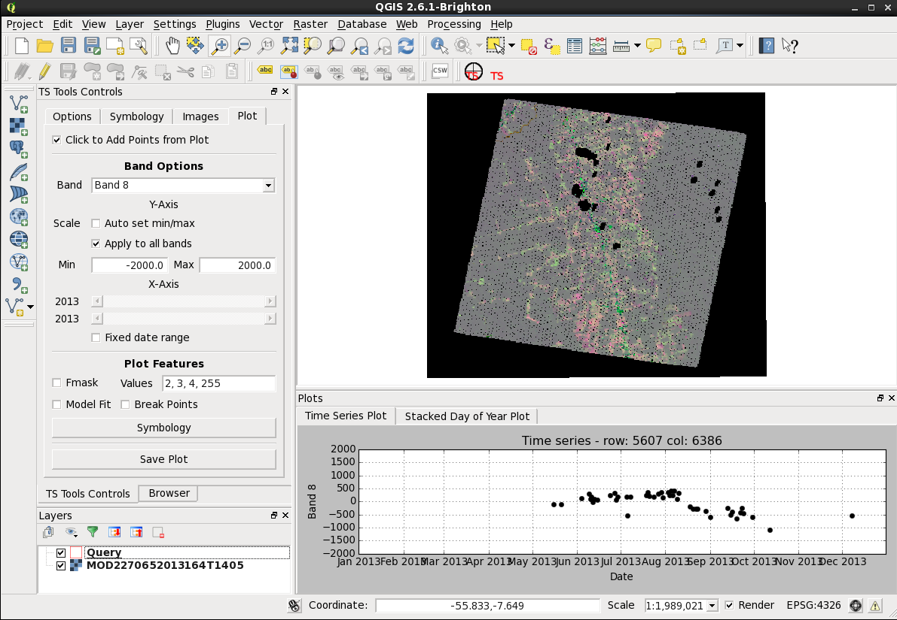
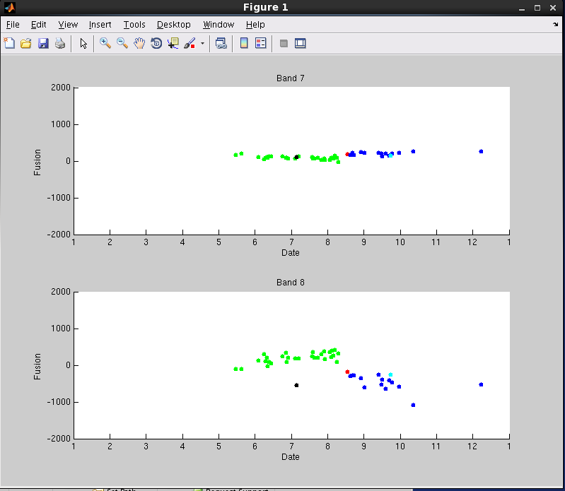
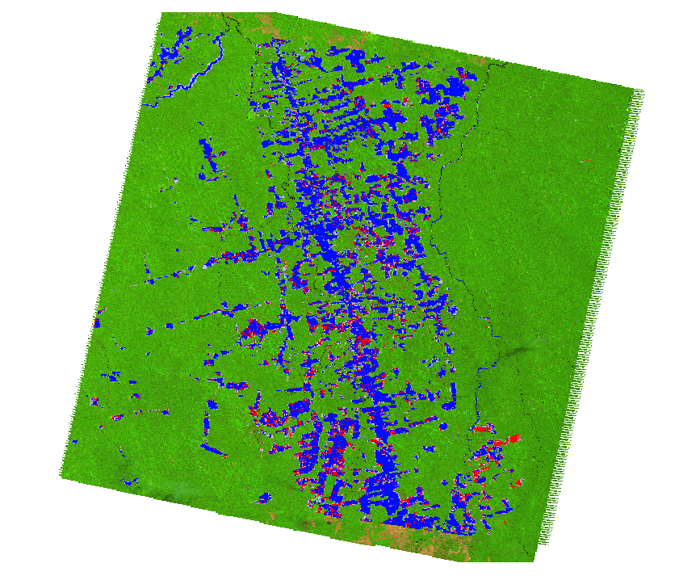
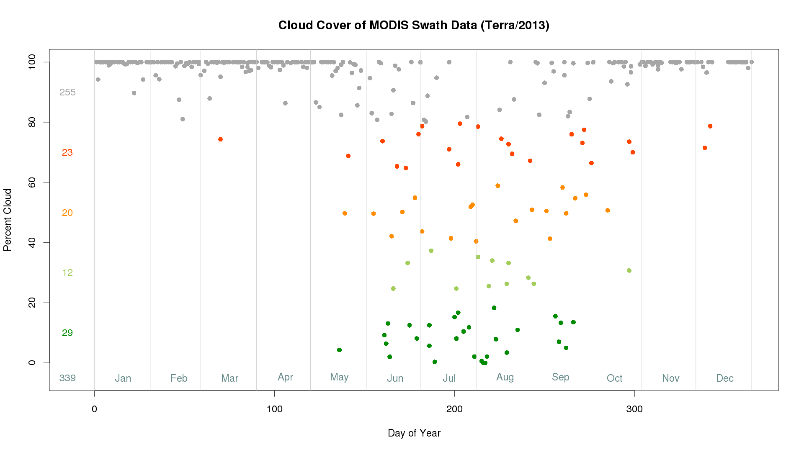
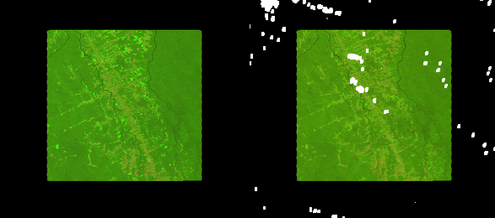
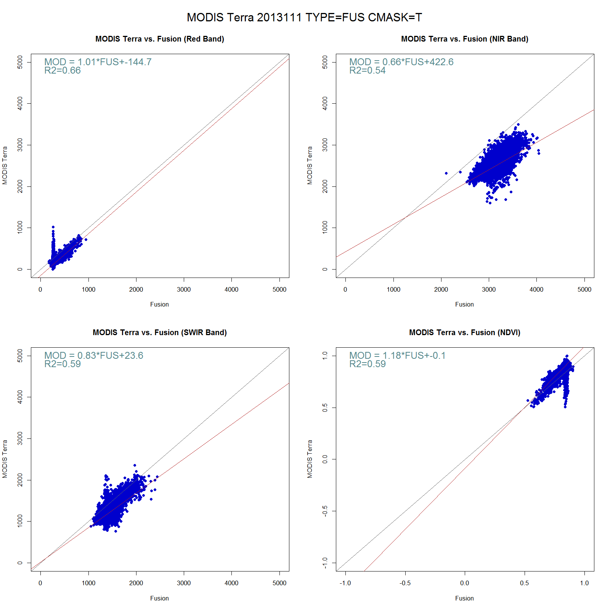

# The New Fusion
## Check Result
The New Fusion model stores all intermediate data and outputs of each step in the main work folder that you specified. Some outputs will be in MATLAB format (.m) while some are in remote sensing image formats (e.g. hdf, envi). If you actually understand how the model works you are free to check out those files. For normal uers and applications, there are two outputs that need to pay attention with, which is the Fusion time series and the change maps. The output from some tools may also be quite useful for some studies. Here is some examples of how to examine the output of the New Fusion model using our test site.

#### Fusion Time Series

One of the byproduct that the New Fusion model creates is a Fusion time series. It is basically a time series of the residual of our predicted data and observer data. It is stores in the same format as a Landsat time series. The fusion time series are stored in two different formats:
In standard ENVI format:

    /workfolder/PxxxRxxx/ETMDIF/

In MATLAB format:

    /workfolder/PxxxRxxx/CACHE/

You can certainly open individual fusion time series images in ENVI. Here we recommend two other ways to visualize the Fusion time series in a more intuitive way.

##### 1. TSTools QGIS Plugin

The first way to visualize the Fusion time series is to use the [TSTools](https://github.com/ceholden/TSTools) developed by [Christ Holden](http://ceholden.github.io/). TSTools is a nice open source [QGIS](http://www.qgis.org/en/site/) plugin that is designed to visualize Landsat time series. Please check out the [QGIS website](http://www.qgis.org/en/site/) for installation of QGIS and the [Github page of TSTools](https://github.com/ceholden/TSTools) for documentation of TSTools. Here's an example of using TSTools to visualize the Fusion time series:

You are able to examine individual images, overlay with real Landsat images, and also plot the Fusion time series of individual pixel that you selected.

##### 2. Built-in Tools of the New Fusion

The second way to visualize the Fusion time series is to use the built-in tools of the New Fusion program. The tool designed for this is the [check_pixel.m](../tool/check_pixel.m) tool. The tool runs in MATLAB and you will need to specify the config file that you used as well as the row and column of the pixel that you want to check. Open MATLAB, add the code to your path or change your current folder to where you the code is, and enter the following command:

    matlab >> R = check_pixel('YourConfigFile',3000,4000);
    
The tool will generate a stucture, stored in variable R that contains all statistics and records generated during the change detection process for pixel located in row 3000 and col 4000. The tool will also generate a plot of the Fusion time series that looks like the following:

Advanced users can also try the [tune_model.m](../tool/tune_model.m) tool to change the model parameters on the fly and see how it effects change detection of individual pixel. Here's an exmaple of changing the initNoB to 10 and see how the model response:

    matlab >> [~,ModelA] = tune_model('YoutConfigFile');
    matlab >> ModelA.initNoB = 10;
    matlab >> [R,~] = tune_model(ModelA,3000,4000);

#### Change Map

The main product of the New Fusion model is a map that indicates areas of deforestation that occured within your study area and study time period. The map is saved as an image in ENVI format. You can view the image in ENVI or QGIS. You can also port the result to any other climate or ecosystem models that you are interested in. Depending on the type of output map that you specified in the config file you will get slightly different results. The most useful output map is usually the class map. The class map is a thermatic map that includes different catogories of land cover dynamics including stable forest, stable non-forest, confirmed change, unsure change. Here is an example of a change map overlayed on top of a Landsat 9 iamge:

#### Output from tools

Depending on what you are studying, you may find some of the tools can create useful visualizations of the results. Here're a few examples created by the [built-in tools](../tool) of the New Fusion Model.  

1.A cloud plot that shows you how cloudy the MODIS data is in your study area ([cloud_plot.R](../tool/cloud_plot.R)).  

2.A preview of the MODIS swath over your study area ([gen_preview.R](../tool/gen_preview.R)).  

3.A scatter plot with the predicted surface reflectance against the observed surface reflectance ([fusion_plot](../tool/fusion_plot.R)).

